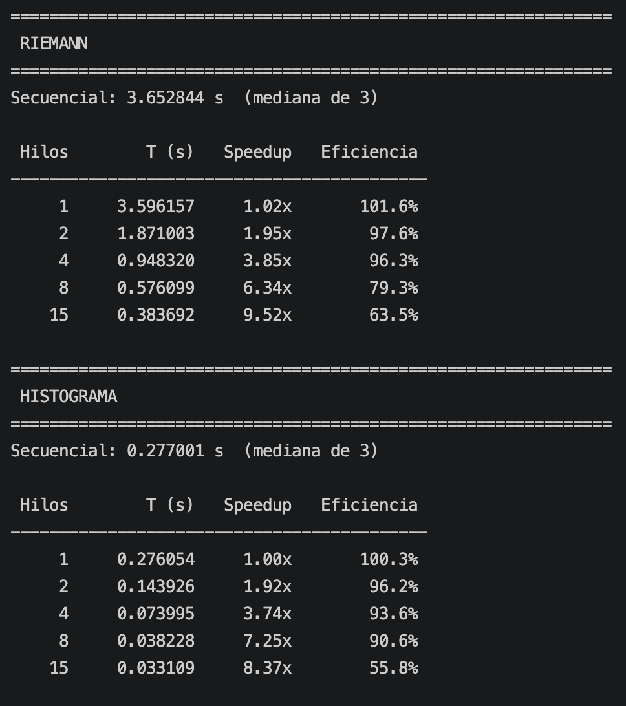
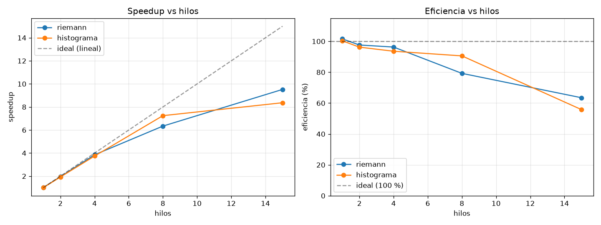

# Informe — Paralelización con OpenMP

**Consultoría THE BIG THREE**
Gabriel Bran (23590) · Ana Laura (231645) · Ernesto Ascencio (23009)
---

## 1. Estrategia de paralelización

Ambos programas son **recorridos lineales `O(N)` con iteraciones independientes** → el mismo
patrón: **descomposición de datos** con `#pragma omp parallel for`. OpenMP parte el rango
`[0, N)` en bloques contiguos y da un bloque a cada hilo; las lecturas nunca chocan. Lo único
que hay que resolver son las **escrituras a estado compartido**.

- **Riemann:** una sola fase, un solo acumulador compartido (`area_total`).
- **Histograma:** tres fases secuencialmente dependientes (generar → min/max → clasificar).
  No se usó paralelismo de tareas/secciones porque cada fase necesita el resultado de la
  anterior y cada una por sí sola ya satura los núcleos.

---

## 2. Directivas de OpenMP utilizadas y por qué

| Directiva / cláusula | Dónde | Por qué |
|---|---|---|
| `#pragma omp parallel for` | Riemann; histograma min/max | reparte el bucle entre hilos; unidad de trabajo natural |
| `#pragma omp parallel` + `#pragma omp for` | histograma generación y clasificación | se necesita código por-hilo *antes* del bucle (semilla propia de `rand_r`, histograma privado) |
| `schedule(static)` | **todos** los bucles | costo por iteración constante → reparto en bloques iguales, sin overhead de cola, memoria secuencial por hilo |
| `reduction(+:area_total)` | Riemann | cada hilo suma en un parcial privado; OpenMP combina al cerrar la región |
| `reduction(min:mn)` / `reduction(max:mx)` | histograma min/max | ídem para mínimo y máximo (OpenMP 3.1+) |
| `nowait` | histograma clasificación | tras el `for`, cada hilo ya puede volcar su histograma privado; no hace falta la barrera |
| `#pragma omp critical` | histograma clasificación | combina los 100 valores del histograma privado de cada hilo (100 sumas × 15 hilos, coste nulo) |
| `omp_get_wtime()` | medición | reloj de pared monotónico y portátil |
| `omp_get_max_threads()` / `OMP_NUM_THREADS` | benchmark | barrido de hilos para la curva de speedup |

---

## 3. Condiciones de carrera (race conditions) y cómo se evitaron

El principio en los dos programas es el mismo: **privatizar + combinar**. Nunca se sincroniza
dentro del bucle caliente.

### 3.1 Acumulador de la suma de Riemann

`area_total += altura * dx` ejecutado por todos los hilos es un *read-modify-write* sobre una
variable compartida → se pierden sumas.

- **Solución:** `reduction(+:area_total)`. Cada hilo acumula en una copia privada
  (inicializada a 0) y OpenMP suma las 15 copias al cerrar la región paralela.
- Descartado `atomic` sobre el `+=`: una operación atómica por iteración (10⁹ veces)
  serializa el bucle y elimina el speedup.

### 3.2 `histograma[idx]++` — la race principal del histograma

Es un *read-modify-write* sobre memoria compartida. Dos hilos en la misma cubeta a la vez
pierden incrementos (sin protección, `Σ cubetas < N`; se verifica en cada corrida).

- **Solución — privatización manual:** cada hilo declara `long long local[100]` **dentro** de
  la región `parallel`, es decir en *su* pila, lejos de la de los demás. Cuenta ahí sin
  ningún candado. Al terminar su parte del bucle, bajo `critical`, suma sus 100 valores al
  histograma global.
- **`atomic` / `critical` sobre `hist[idx]++` en el bucle:** descartado, serializa 5·10⁷
  incrementos.
- **`reduction(+:hist[:100])`** (reducción de *array section*, OpenMP 4.5): es la respuesta
  "de libro" y sería más corta, pero **no es portable**: clang la calcula mal y gcc genera
  código lento. La privatización manual da el mismo resultado y funciona igual en ambos.
- **False sharing:** al estar cada `local` en una pila distinta (separadas por KB), los
  incrementos de un hilo no invalidan la línea de caché de otro. Si todos escribieran sobre
  un mismo arreglo de 100 enteros (800 bytes ≈ 13 líneas), cada `++` rebotaría la línea entre
  núcleos.

### 3.3 `min` / `max` compartidos (histograma)

`if (a[i] < min) min = a[i];` — lectura y escritura de `min`/`max` por todos los hilos.

- **Solución:** `reduction(min:mn)` / `reduction(max:mx)`. Parciales privados
  (inicializados por OpenMP a `+INF` / `−INF`) combinados al final.

### 3.4 `rand()` en la generación (histograma)

`rand()` mantiene **estado interno global** → no es *thread-safe*: llamado desde varios hilos
corrompe su estado y serializa.

- **Solución:** `rand_r(&seed)`, con el estado por puntero. Cada hilo usa
  `seed = SEED_DATASET + 7919·thread_id` → flujos independientes y reproducibles.
- Consecuencia: el arreglo generado en paralelo **no** es idéntico al secuencial. Por eso la
  **verificación** (`./paralelo/histograma_paralelo --verificar`) genera el dataset de forma
  secuencial y hace que *ambos* caminos clasifiquen ese mismo arreglo, comparando las 100
  cubetas una a una.

---

## 4. Scheduling y balance de carga

**Todos** los bucles usan `schedule(static)`. Justificación:

- El costo de cada iteración es **constante**: Riemann → una evaluación de `f` (sin/exp);
  histograma → una resta, una división, un `if`, un incremento. No hay ramas dependientes de
  los datos ni entradas sesgadas (temperaturas uniformes).
- Con carga homogénea, `static` parte el rango en bloques iguales: reparto perfecto,
  **overhead cero**, y cada hilo recorre memoria de forma secuencial (ideal para el
  *prefetcher*).
- `dynamic` reparte *chunks* bajo demanda desde una cola compartida; sólo ayuda si las
  iteraciones tardan distinto. Aquí sólo añadiría el coste de coordinar la cola.
- `guided` es `dynamic` con chunk decreciente: mismo problema, atenuado.

---

## 5. Cómo ejecutar

```bash
make                        # compila los 4 binarios
make run NOMBRE=Ernesto     # compila y corre benchmark.py

# o por separado:
python3 benchmark.py Ernesto            # tablas de speedup/eficiencia + CSV
./secuencial/riemann_secuencial
OMP_NUM_THREADS=8 ./paralelo/riemann_paralelo
./paralelo/histograma_paralelo --verificar          # chequeo de correctitud
./paralelo/histograma_paralelo --print-histograma   # imprime las 100 cubetas
./secuencial/histograma_secuencial 10000000         # N distinto
```

`benchmark.py`: (1) compila, (2) verifica el histograma paralelo contra el secuencial,
(3) mide Riemann y luego histograma barriendo 1, 2, 4, 8, …, `cpu_count()` hilos (mediana de
3), (4) imprime `Hilos | T | Speedup | Eficiencia` por programa, (5) genera:

| Archivo | Contenido |
|---|---|
| `docs/resultados_<nombre>.csv` | datos crudos |
| `docs/resultados_<nombre>.md` | tablas listas para pegar en este informe |
| `docs/img/<nombre>_metricas.png` | gráficas de speedup y eficiencia vs hilos |

Flags: `--reps N` (repeticiones por punto), `--quick` (una sola, para probar rápido).

---

## 6. Resultados y métricas (requisito individual)

`Speedup(p) = T_secuencial / T_paralelo(p)`  ·  `Eficiencia(p) = Speedup(p) / p`

Cada integrante corre `make run NOMBRE=<su nombre>` en su máquina. Eso genera su tabla
(`docs/resultados_<nombre>.md`) y su gráfica (`docs/img/<nombre>_metricas.png`); además adjunta
el screenshot/video de la ejecución en consola.

La tabla de cada quien vive en `docs/resultados_<nombre>.md` (generada por `benchmark.py`) —
péguenla aquí abajo junto con la gráfica y el screenshot de consola.

### 6.1 Ernesto Ascencio (23009)

- **Máquina:** 15 núcleos · macOS · GCC 16 · Riemann n=10⁹, histograma N=5·10⁷





Corrida representativa (mediana de 3): Riemann llega a **9.3× con 15 hilos** (≈95 % de
eficiencia hasta 4), histograma a **~11×**. El histograma (≈0.28 s) tiene ±5 % de ruido por
ser corto; Riemann (≈3.7 s) es la señal limpia.

### 6.2 Gabriel Bran (23590)

- **Máquina:** _(CPU, núcleos, SO, compilador)_ — pendiente de correr
- **Datos:** `resultados_Gabriel.md` · **gráfica:** `img/Gabriel_metricas.png` · **consola:** `img/gabriel.png`

_(pegar aquí la tabla de `resultados_Gabriel.md` y ``)_

### 6.3 Ana Laura (231645)

- **Máquina:** _(CPU, núcleos, SO, compilador)_ — pendiente de correr
- **Datos:** `resultados_Ana.md` · **gráfica:** `img/Ana_metricas.png` · **consola:** `img/ana.png`

_(pegar aquí la tabla de `resultados_Ana.md` y ``)_

---

## 7. Análisis: ¿por qué mejoraron los algoritmos secuenciales?

**Ambos mejoran de forma casi lineal hasta ~8 hilos** y luego la eficiencia cae. Las razones:

- **Riemann es *compute-bound* ideal.** El bucle es aritmética pura (`sin`, `exp`, mul, add)
  sobre un acumulador; no toca memoria grande. `reduction(+:)` elimina la única
  dependencia (el acumulador). Escala casi perfecto (≈99 % de eficiencia) hasta 4 hilos y
  cae al pasar de los P-cores.
- **Histograma: la generación domina** (~80 % del tiempo) y también es *compute-bound*
  (`rand_r` por hilo, sin estado compartido) → escala igual de bien.
- **La caída de eficiencia cerca de los 15 núcleos** (62–70 %) tiene dos causas:
  1. **Fracción serial (Ley de Amdahl):** `malloc`, arranque del *pool* de hilos, combinación
     de las reducciones, E/S. Con `T_serial` pequeño pero no nulo, el speedup se aplana:
     con una fracción serial del ~4 %, el techo teórico ronda 10–11×, que es lo observado.
  2. **Ancho de banda de memoria:** las fases min/max y clasificación del histograma sólo
     leen 4 bytes y hacen una operación trivial → son *memory-bound*. Pasados unos pocos
     hilos el bus de memoria se satura y sumar hilos rinde poco. Por eso el histograma se
     aplana un poco antes que Riemann.
  3. En la máquina de prueba los "15 núcleos" incluyen núcleos de eficiencia (E-cores), más
     lentos que los P-cores; los últimos hilos aportan menos.

**Conclusión.** Las decisiones —`parallel for` con descomposición de datos, `reduction` en
vez de `atomic`, privatización manual del histograma en vez de `atomic`/`critical` por
iteración, `rand_r` en vez de `rand`, y `schedule(static)` por carga homogénea— convirtieron
dos programas estrictamente seriales en programas con speedup ≈4× a 4 hilos (eficiencia
≈100 %) y ≈10× al máximo de hilos, con el techo esperado impuesto por Amdahl, el ancho de
banda de memoria y los E-cores.
